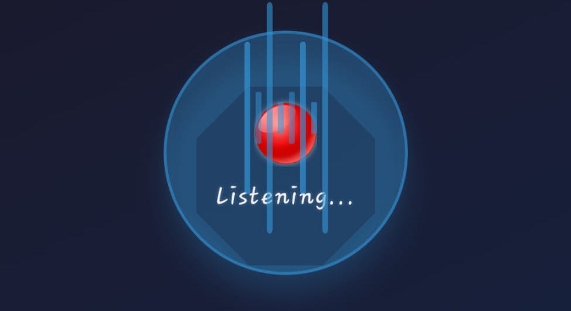

# iHearYOU 

> ICS 2402: User Interface Architectures

this is an [expo](https://expo.dev) project created with [`create-expo-app`](https://www.npmjs.com/package/create-expo-app).


a solution that demonstrates both input (speech recognition) and output (visual + auditory) channels in HCI.

## environment
> **list of things I dislike**: [windows, windows setup, etc]  
> first off, please use a linux environment if you can. skill issue if you're on windows man - a joke :) it should be relatively easy, though, to work on a linux environment; this will save you lots of setup troubles.

## analysis:
“hold up and analyze” —raekwon :)  
the project can be interpreted and categorized  broadly into:
- **input channel**: this utilizes user’s hearing (voice recognition - "blue" or "red")
- **output channels**:
auditory (text-to-speech feedback)
visual (colored screens)

## implementation:
first of all I think allowing for continuosly listening for speech without using a button is absurd...  
in this context the structure/working of the ihearyou application should be/is as follows:  
1. initialize speech recognition; listen for "blue" or "red" between button pressing and releasing/when a person stops talking
2. when detected: play tts response + change screen color  





## setup
> **[!NOTE]**:  
> you can use anything from `bun`, `yarn`, `npm`, `pnpm` for your node/javascript packages.

### a) setup from this repo
   ```sh
   # clone repo
   git clone git@github.com:Yume-Lock/iHearYOU.git
   cd iHearYOU # rename to i-hear-you if necessary
   # add specific packages
   # or specific versions if you want (see first time setup if necessary for this)
   bun install 
   ```

### b) first time setup

1. create expo app:
   ```sh
   bun create expo-app i-hear-you
   cd i-hear-you
   ```

2. install dependencies

   ```sh
   bun add expo expo-speech expo-status-bar react-native-webview
   bun add react-native-svg react-native-linear-gradient

   # development dependencies (typescript support)
   bun add -d typescript @types/react@~19.1.10 @types/react-native
   ```

### c) start the app

   ```bash
   bun expo start # bun run start
   ```

in the output, you'll find options to open the app in a

- [development build](https://docs.expo.dev/develop/development-builds/introduction/)
- [android emulator](https://docs.expo.dev/workflow/android-studio-emulator/)
- [iOS simulator](https://docs.expo.dev/workflow/ios-simulator/)
- [expo go](https://expo.dev/go), a limited sandbox for trying out app development with expo (install and use `expo go` to scan `QR` code of the runnig react native/expo app for testing on android)

you can start developing by editing the files inside the **[src](./src/)** directory.


## files:
```sh
i-hear-you/
├── App.tsx                          # main entry point
├── app.json                         # expo config
├── package.json
├── tsconfig.json                    # typeScript conf
├── bun.lock
├── assets/
└── src/
    ├── components/                  # react components
    │   └── IHearYou.tsx
    │   └── SiriAnimations.tsx     # wave and pulse animations
    ├── hooks/
    │   └── useSpeechRecognition.ts
    ├── services/
    │   └── SpeechRecognitionService.ts
    ├── types/
    │   └── speech.ts               # speech-related types
    ├── utils/
    │   └── SpeechProcessor.ts      # command processing
    ├── styles/
    │   └── styles.ts
    └── index.ts
```

---
## authors:

| Name | Role |
|------|------|
| Jany Muong | Developer |
| Joram Kireki | Developer |
| Vincent Ochieng | Developer |
| Akech Atem | Developer |
| Gatmach Yuol Nyuon | Developer |
| Josphat Waweru Thumi | Developer |