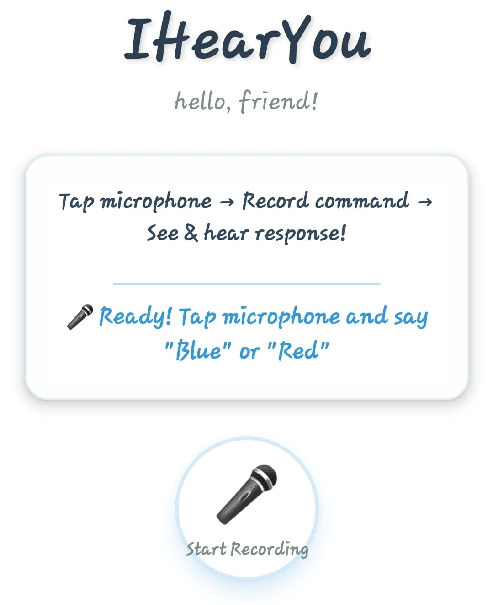

# iHearYOU 

> ICS 2402: User Interface Architectures

this is an [expo](https://expo.dev) project created with [`create-expo-app`](https://www.npmjs.com/package/create-expo-app).


a solution that demonstrates both input (speech recognition) and output (visual + auditory) channels in HCI.

## environment
> **list of things I dislike**: [windows, windows setup, etc]  
> first off, please use a linux environment if you can. skill issue if you're on windows man - a joke :) it should be relatively easy, though, to work on a linux environment; this will save you lots of setup troubles.

## analysis:
“hold up and analyze” —raekwon :)  
the project can be interpreted and categorized  broadly into:
- **input channel**: this utilizes user’s hearing (voice recognition - "blue" or "red")
- **output channels**:
auditory (text-to-speech feedback)
visual (colored screens)

## implementation:
first of all I think allowing for continuosly listening for speech without using a button is absurd...  
in this context the structure/working of the ihear-you application should be/is as follows:  
1. initialize speech recognition on button pressing - listen for "blue" or "red" when the button for listening is pressed and stop button is pressed as well. 
2. when detected:
play tts response
change screen color  




## setup

> **[!NOTE]**:  
> you can use anything from `bun`, `yarn`, `npm`, `pnpm` for your node/javascript packages.

1. create expo app:
   ```sh
   bun create expo-app i-hear-you
   cd i-hear-you
   ```

2. install dependencies

   ```sh
   bun add expo-av expo-audio expo-haptics
   bun add -d @types/react # @types/react@~19.1.10
   ```

3. start the app

   ```bash
   bun expo start
   ```

in the output, you'll find options to open the app in a

- [development build](https://docs.expo.dev/develop/development-builds/introduction/)
- [android emulator](https://docs.expo.dev/workflow/android-studio-emulator/)
- [iOS simulator](https://docs.expo.dev/workflow/ios-simulator/)
- [expo go](https://expo.dev/go), a limited sandbox for trying out app development with expo

you can start developing by editing the files inside the **app** directory. this project uses [file-based routing](https://docs.expo.dev/router/introduction).


## files:
```sh
i-hear-you/
├── App.js
├── app.json
├── package.json
├── bun.lockb
└── assets/
```


## get a fresh project

when you're ready, run:

```bash
# dont do this
npm run reset-project
```

this command will move the starter code to the **app-example** directory and create a blank **app** directory where you can start developing.


---
## developers:
- Jany Muong
- Joram Kireki
- Vincent Ochieng
- Akech Atem
- Gatmach Yuol Nyuon
- Josphat Waweru Thumi